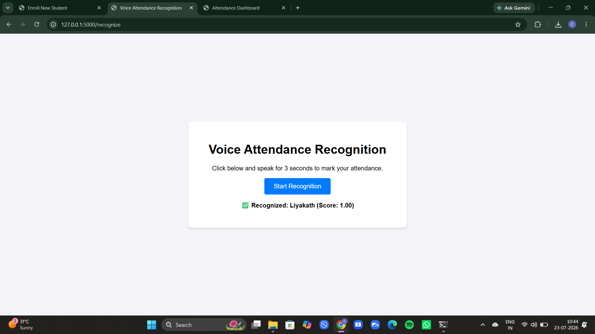
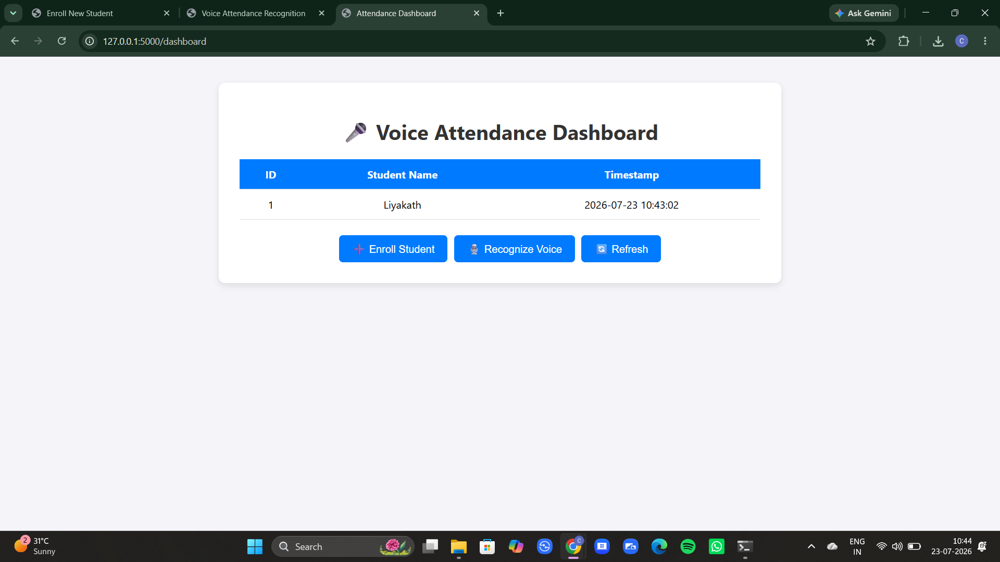

# 🎤 Voice-Based Attendance System


An AI-powered **Voice-Based Attendance System** built using **Python, Flask, SpeechBrain, PyTorch, and MySQL**. The system recognizes registered students by their voice and automatically records attendance with a timestamp, providing a secure and contactless attendance solution.

---

## 📖 Project Overview

Traditional attendance systems require manual intervention or physical interaction. This project leverages **Speaker Recognition** to identify registered users using their voice. Once authenticated, the system automatically records attendance in a MySQL database along with the current date and time.

---

## ✨ Features

- 🎙️ Voice-based student enrollment
- 🔊 Speaker recognition using SpeechBrain ECAPA-TDNN
- 📝 Automatic attendance marking
- 🗄️ MySQL database integration
- 📊 Attendance dashboard
- ⏰ Automatic timestamp recording
- 🌐 User-friendly Flask web interface
- ⚡ Fast and contactless authentication

---

## 🛠️ Technology Stack

| Category | Technologies |
|----------|--------------|
| Programming Language | Python |
| Backend | Flask |
| Frontend | HTML, CSS, JavaScript |
| Deep Learning | PyTorch |
| Speaker Recognition | SpeechBrain (ECAPA-TDNN) |
| Database | MySQL |
| Model Hosting | Hugging Face |

---

## 📋 Requirements

- Python 3.10 or later
- MySQL Server
- pip
- Virtual Environment (recommended)

---

## 🔄 Project Workflow

```text
Student Enrollment
        │
        ▼
Record Three Voice Samples
        │
        ▼
Generate Speaker Embeddings
        │
        ▼
Store Voice Embeddings
        │
        ▼
Voice Recognition
        │
        ▼
Compare with Registered Voices
        │
        ▼
Recognized Successfully
        │
        ▼
Attendance Stored in MySQL
        │
        ▼
Display Attendance Dashboard
```

---

## 📂 Project Structure

```text
Voice-Based-Attendance-System/
│
├── app.py
├── requirements.txt
├── README.md
├── LICENSE
├── .gitignore
│
├── templates/
│   ├── dashboard.html
│   ├── enroll.html
│   └── recognize.html
│
├── pretrained_models/
├── uploads/
├── images/
│   ├── enrollment.png
│   ├── recognition.png
│   └── dashboard.png
│
└── ...
```

---

## 🚀 Installation

### 1. Clone the Repository

```bash
git clone https://github.com/chowdaryliyakath/Voice-Based-Attendance-System.git
```

### 2. Navigate to the Project Directory

```bash
cd Voice-Based-Attendance-System
```

### 3. Create a Virtual Environment

```bash
python -m venv venv
```

### 4. Activate the Virtual Environment

**Windows**

```bash
venv\Scripts\activate
```

**Linux/macOS**

```bash
source venv/bin/activate
```

### 5. Install Dependencies

```bash
pip install -r requirements.txt
```

### 6. Configure MySQL

- Create a MySQL database.
- Update the database credentials inside `app.py`.

### 7. Run the Application

```bash
python app.py
```

Open your browser and visit:

```text
http://127.0.0.1:5000
```

---

## 🎥 Demo

The web application provides three main functionalities:

- 🎙️ Enroll a new student using voice samples
- 🔊 Recognize a registered student's voice
- 📊 View attendance records on the dashboard

---

## 📸 Screenshots

### 🎙️ Student Enrollment

Register a new student by recording three voice samples.


---

### 🔊 Voice Recognition

Recognize a registered student's voice and display the confidence score.



---

### 📊 Attendance Dashboard

View attendance records including Student ID, Name, Date, and Time.



---

## 🎯 Applications

- 🎓 Educational Institutions
- 🏫 Schools, Colleges, and Universities
- 🏢 Corporate Employee Attendance Systems
- 🔬 Research Laboratories
- 🔐 Contactless Authentication Systems

---

## 🚀 Future Enhancements

- 👤 Face Recognition Integration
- 📱 Mobile Application
- ☁️ Cloud Database Support
- 🔐 Admin Login System
- 📈 Attendance Analytics Dashboard
- 📧 Email Notifications
- 🌍 Multi-user Deployment
- 🔒 Multi-factor Authentication

---

## 👨‍💻 Author

**Chowdary Liyakath**

B.Tech – Electronics Engineering (VLSI Design & Technology)

Vellore Institute of Technology (VIT)

GitHub Profile: [@chowdaryliyakath](https://github.com/chowdaryliyakath)

Project Repository: [Voice-Based-Attendance-System](https://github.com/chowdaryliyakath/Voice-Based-Attendance-System)

## 📄 License

This project is licensed under the **MIT License**.

See the **LICENSE** file for more details.

---

## 🙏 Acknowledgements

This project uses the following open-source technologies:

- SpeechBrain
- PyTorch
- Flask
- Hugging Face
- MySQL

---

## ⭐ Support

If you found this project useful, please consider giving it a ⭐ on GitHub.

Your support is greatly appreciated and motivates future improvements.
